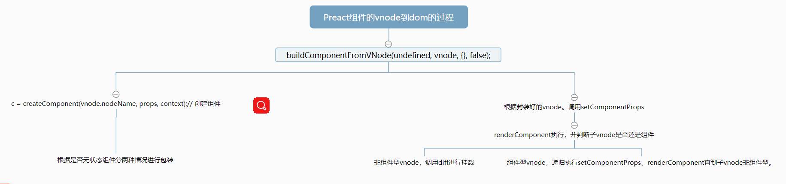

>  紧接上节，Preact组件从vnode到真实html的过程发生了什么？

```javascript
...
// buildComponentFromVNode方法内部
// buildComponentFromVNode(undefined, vnode, {}, false);
c = createComponent(vnode.nodeName, props, context);// 创建组件
setComponentProps(c, props, SYNC_RENDER, context, mountAll);
dom = c.base;
    return dom;
....
```

从上节组件变成真实dom的过程中最重要的函数就是```createComponent```和```setComponentProps```。我们可以发现，在先后执行了```createComponent```和```setComponentProps```后，真实dom就是c.base了。那么
这个```createComponent```干了什么？去掉一些初始渲染时不会去执行的代码，简化后的代码如下：

```javascript
// 如果是用class定义的那种有生命周期的组件，上文代码中的```vnode.nodeName```其实就是我们定义的那个class。
export function createComponent(Ctor, props, context) {
    let inst;
    if (Ctor.prototype && Ctor.prototype.render) {
        // 正常的组件 class xxx extends Component{} 定义的
        //首先是对自己的组件实例化
        inst = new Ctor(props, context);
        //然后再在我们实例化的组件，去获得一些Preact的内置属性(props、state，这两个是挂在实例上的)和一些内置方法(setState、render之类的，这些方法是挂在原型上的)
        Component.call(inst, props, context);
    } else {
        // 无状态组件
        //无状态组件是没有定义render的，它的render方法就是这个无状态组件本身
        inst = new Component(props, context);
        inst.constructor = Ctor;
        inst.render = doRender;
    }
    return inst;
}

function doRender(props, state, context) {
    // 无状态组件的render方法就是自己本身
    return this.constructor(props, context);
}
```
Component的定义如下。通过上面和下面的代码可以知道，```createComponent```的主要作用就是让我们编写的class型和无状态型组件实例化，
这个实例是具有相似的结构。并供后面的```setComponentProps```去使用产生真实dom。

```javascript
// Component的定义
export function Component(props, context) {
	this._dirty = true;// 这个东西先不管，应该是和diff有关
	this.context = context;// context这个东西我也暂时不知道有什么用
	this.props = props;
	this.state = this.state || {};
}
// 这里的extend就是一个工具函数，把setState、forceUpdate、render方法挂载到原型上
extend(Component.prototype,{
    setState(state,callback){},
    forceUpdate(callback){},
    render() {}
})
```

```setComponentProps```产生真实dom的过程。
```javascript
setComponentProps(c, props, SYNC_RENDER, {}, false);

export function setComponentProps(component, props, opts, context, mountAll) {
    // 同理去除条件不成立的代码，只保留首次渲染时运行的关键步骤
    if (!component.base || mountAll) {
        // 可见。componentWillMount生命周期方法只会在未加载之前执行，
        if (component.componentWillMount) component.componentWillMount();
    }
    renderComponent(component, SYNC_RENDER, mountAll);
}
```

由上面代码可见，```setComponentProps```内部，实际上关键是调用了```renderComponent```方法。```renderComponent```逻辑有点绕，
精简版代码如下。

```renderComponent```主要逻辑简单来说如下：
1、调用组件实例的render方法去产生vnode。

2、如果这个组件产生的vnode不再是组件了。则通过```diff```函数去产生真实dom并挂载（前面已经分析过）```diff(cbase, rendered, context, mountAll || !isUpdate, initialBase && initialBase.parentNode, true);```。

3、如果这个组件的子vnode还是子组件的话。则再次调用```setComponentProps```、```renderComponent```去进一步生成真实dom，直到2中条件成立。（判断步骤和2、3类似），但是有点区别的是。这种调用代码是

```javascript
setComponentProps(inst, childProps, NO_RENDER, context, false);// 不渲染。只是去执行下生命周期方法，在这个setComponentProps内部是不调用 renderComponent的。 至于为啥。。暂时我也不知道。NO_RENDER标志位
renderComponent(inst, SYNC_RENDER, mountAll, true);
```

精简版代码
```javascript
export function renderComponent(component, opts, mountAll, isChild) {
    // 这个函数其实很长有点复杂的，只保留了初次渲染时执行的部分和关键的部分。
        // 调用组件的render方法，返回vnode
        rendered = component.render(props, state, context);//*****
        let childComponent = rendered && rendered.nodeName,base;
        if (typeof childComponent === 'function') {
            // 子节点也是自定义组件的情况
            let childProps = getNodeProps(rendered);
                component._component = inst = createComponent(childComponent, childProps, context);
				setComponentProps(inst, childProps, NO_RENDER, context, false);// 不渲染啊。只是去执行下生命周期方法
                renderComponent(inst, SYNC_RENDER, mountAll, true);// 对比  renderComponent(component, SYNC_RENDER, mountAll);
        } else {
            base = diff(。。。);// 挂载
        }
        component.base = base; //把真实dom挂载到base属性上
        if (!diffLevel && !isChild) flushMounts();
}
```

前面看到了```componentWillMount ```生命周期了，那么``` componentDidMount```这个生命周期呢？它就是```在flushMounts```。这个if语句成立的条件是在祖先组件并且初次渲染时才执行（初次渲染的diffLevel值为0）。

```javascript
export function flushMounts() {
    let c;
    while ((c = mounts.pop())) {
        if (options.afterMount) options.afterMount(c);
        if (c.componentDidMount) c.componentDidMount();
    }
}
```
flushMounts中的mounts就是当前挂载的组件的实例。它是一个栈的结构并依次出栈执行componentDidMount。所以，
这就能说明了Preact（React也一样）父子组件的生命周期执行顺序了 parentWillMount -> parentRender -> childWillMount -> childRender -> childDidMount -> parentDidParent。

至此组件类型的vnode产生真实dom的分析就结束了。

流程图如下
